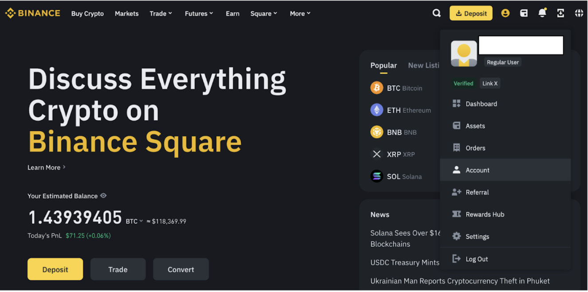
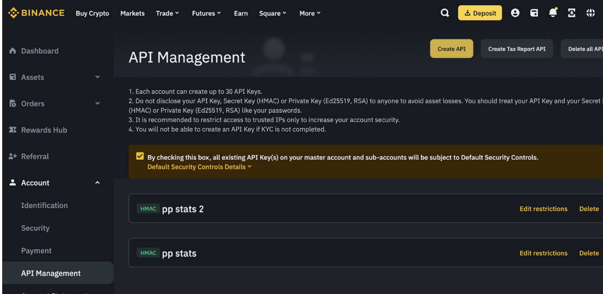
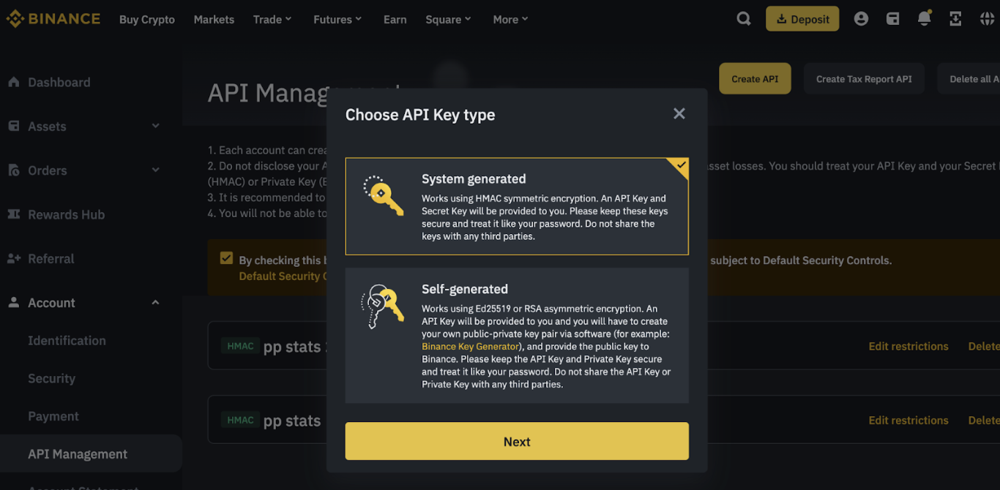
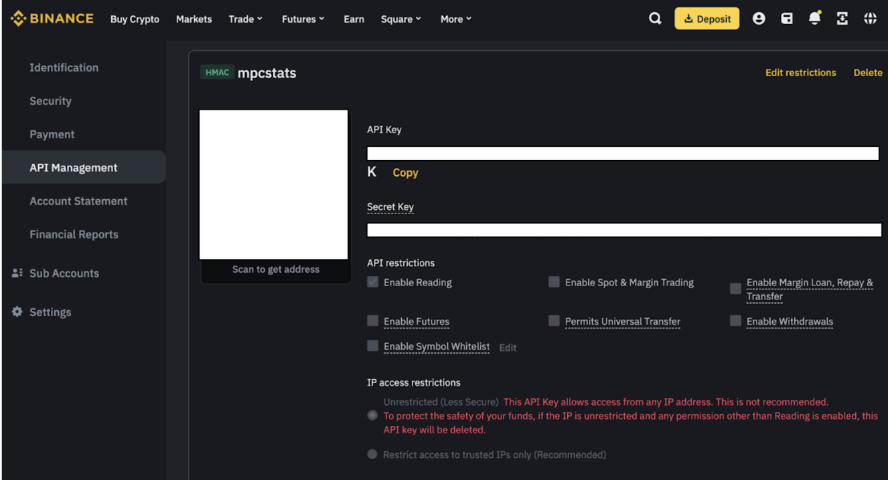

# ETH Inequality @ DevCon 2024

Welcome to the [ETH Inequality Demo @ DevCon 2024](https://demo.mpcstats.org/). Join us in the [Telegram](https://t.me/mpcstats) to stay tuned for more updates!

This guide will help you participate in our survey of ETH distribution across Binance users at DevCon 2024. Don't worry - your data stays private and secure through [MPCStats](https://github.com/ZKStats/mpc-demo-infra) and [TLSNotary](https://tlsnotary.org/).

### Privacy & Security Details
- Your exact balance remains private through secure multi-party computation (MPC)
- The computing parties may learn the number of digits of your balance
- Security relies on the assumption that our 3 computing parties do not collude
- Your API keys are never stored and are only used once to fetch your balance

## Share Your Binance ETH Balance Privately

### Before You Start
You'll need:
- Docker installed on your computer ([Get Docker here](https://docs.docker.com/get-docker/))
- A Binance account with some ETH holdings

⚠️ Important Note: Only 'Free' ETH in your spot account will be counted. This excludes:
- ETH in open orders
- ETH in locked staking
- ETH in savings products
- ETH used as collateral
- ETH in futures/margin accounts

### Step 1: Get Your Binance API Key
1. Log into [Binance.com](https://www.binance.com) and navigate to:
   - Click "Account"
   - Select "API Management"
   - [Direct link to API Management](https://www.binance.com/en/my/settings/api-management)



2. Create a new API key:
   - Click the yellow "Create API" button
   - Choose "System generated"
   - Enter a name for your API key (can be anything)
   - Complete any required verification steps


3. Important Security Settings:
   - ✅ Make sure ONLY "Enable Reading" is selected
   - ❌ Leave all other permissions disabled
   - Save both keys somewhere safe:
     - API Key (looks like: "aBc1234...")
     - Secret Key (looks like: "xYz5678...")


🔒 Security Note: Keep your Secret Key private! Our demo only needs read-only access to check your ETH balance, and we never store your keys.

### Step 2: Run the Privacy-Preserving Script

First, make sure Docker is running on your computer!

Open a terminal/command prompt and run these commands:

```bash
git clone https://github.com/ZKStats/mpc-demo-infra.git
cd mpc-demo-infra/mpc_demo_infra/client_cli/docker
./build.sh
```

Run the script with your details:
```bash
./share-data.sh <eth-address> <binance-api-key> <binance-api-secret>

# Example (DO NOT COPY, USE YOUR OWN VALUES):
# ./share-data.sh 0x123...abc aBc1234... xYz5678...
```

You'll see the following output:

```
Binance ETH balance data has been shared secretly to MPC parties.
```

### Step 3: Query the Results
Visit https://demo.mpcstats.org/ to see the results, or run:
```bash
cd mpc-demo-infra/mpc_demo_infra/client_cli/docker
./query-results.sh
```

### Need Help?
- Having trouble? Contact us on [Telegram](https://t.me/mpcstats)

### Troubleshooting
Common issues:
1. Docker not running → Start Docker Desktop or Docker daemon
2. Script fails → Check your API key and secret are copied correctly
